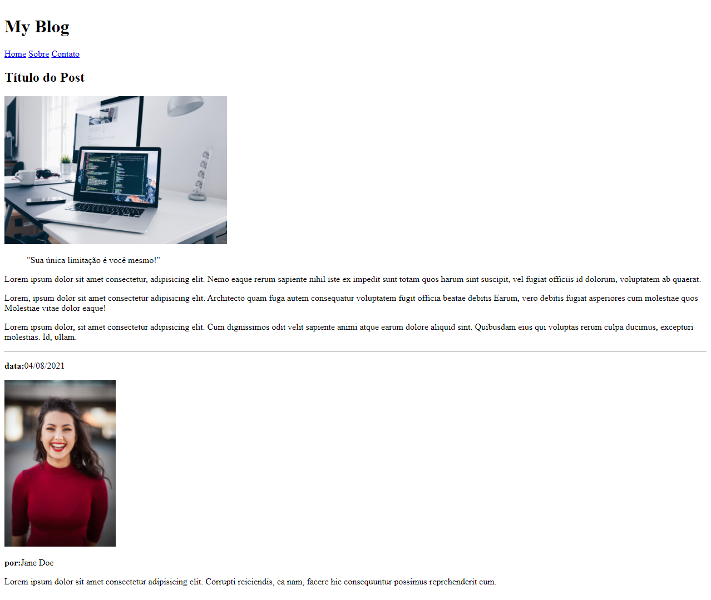

## Projeto

Neste desafio criado como sugestão da Rocketseat, devemos criar a estrutura HTML para a página de post de um blog.

**Requisitos para o desafio:**

- Adicione um header com o nome do blog em negrito e adicione links para páginas "Home", "Sobre" e "Contato".

- O post do blog deve ficar dentro da tag article

- Lembre-se de dar um título para o documento usando a tag <title>

**A estrutura do post**

- Adicione um **título** para o post

**O post deve ter:**

- Uma imagem. Para que a imagem não fique muito grande, você pode usar o atributo width adicionando uma largura de 400px.

- Adicione uma citação

- Crie mínimo 3 parágrafos (você pode usar o `lorem` para criar o texto dos parágrafos)

- Adicione também um separador `
`

- Adicione um `aside` com as informações sobre o autor do post:

  - data da postagem
  - adicione uma imagem do autor
  - nome do autor
  - um pequeno texto sobre o autor

- Ao finalizar, o resultado será parecido com o da imagem abaixo:

