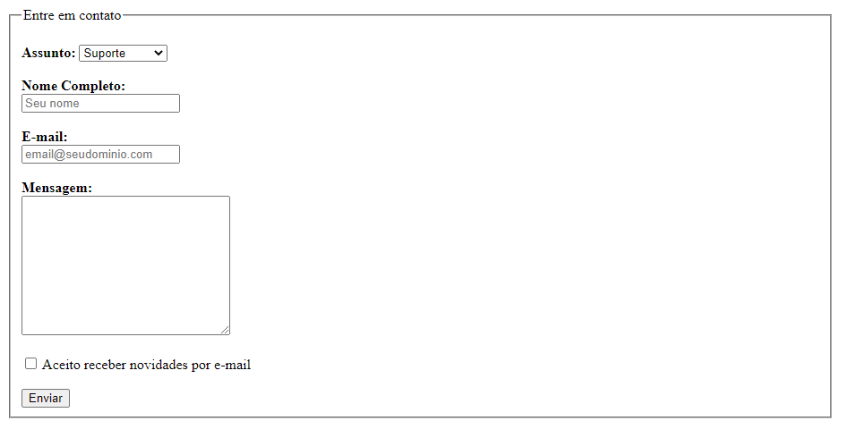

## Projeto

Este é um formulário de contato criado como sugestão da Rocketseat.

**Requisitos para o desafio:**

- Lembre-se de dar um título para o documento usando a tag <title>

- Dentro do formulário adicione um `fieldset` com `legend` "Entre em contato"

- Adicione um `select` para que o usuário possa escolher o assunto do contato (ex: suporte, sugestão e reclamação)

- Adicione campos para que o usuário possa escrever seu **nome completo** e **e-mail**

  - Lembre-se de usar o `type` correto para cada tipo de input

- Adicione uma área de texto para que o usuário possa enviar uma **mensagem**

- Adicione um campo com um `checkbox` e o texto "Aceito receber novidades por e-mail"

- O formulário deve ter um botão "Enviar"

- Ao finalizar, o resultado será parecido com o da imagem abaixo:

