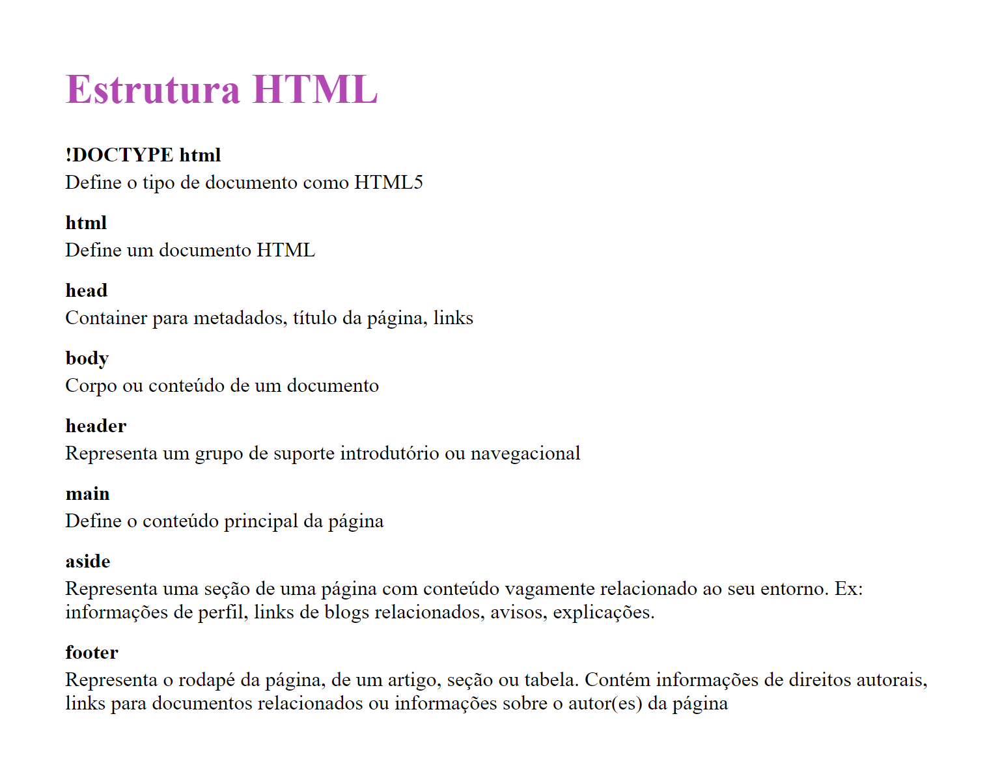
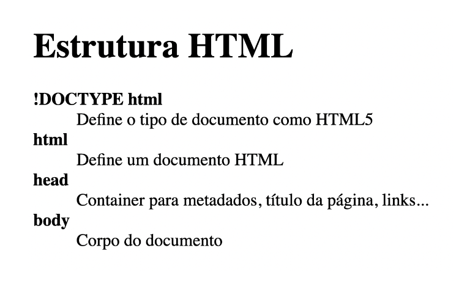

<h1 align="center">
  
</h1>
## Projeto

Este é um glossário criado como sugestão da Rocketseat.

**Requisitos para o desafio:**

- Adicione um título para a página.

- Para criar o glossário, você deve usar uma lista de descrição (<dl>).

- O termo da descrição deve estar em negrito.

  - Bônus: o termo da descrição pode ser um link que leva para a documentação sobre o elemento HTML

- Deve ter no mínimo 4 tags HTML e suas definições.

- Ao finalizar, o resultado será parecido com o da imagem abaixo:

