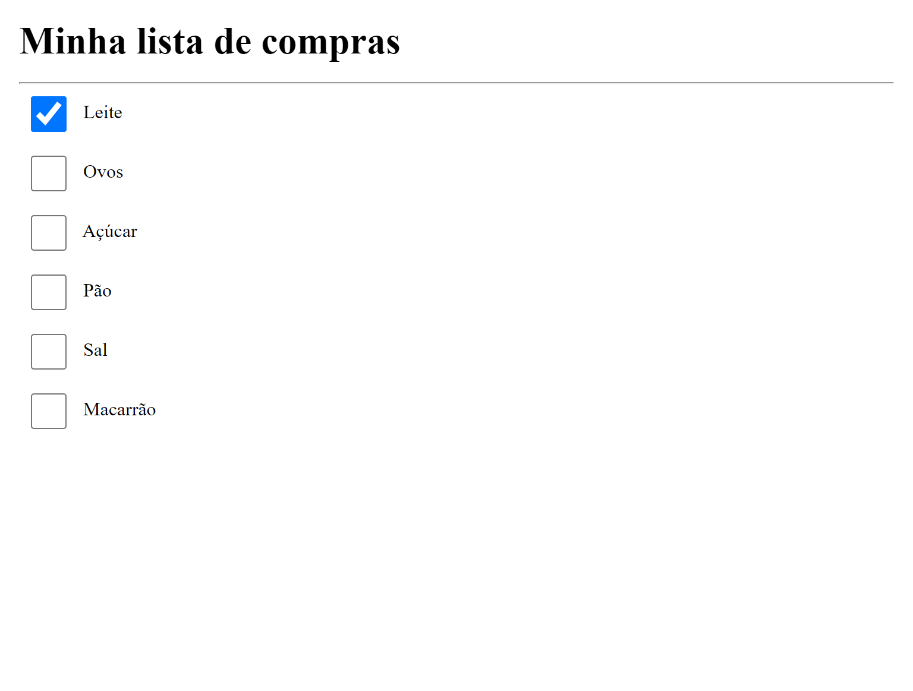
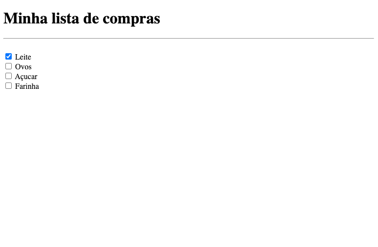

<h1 align="center">
  
</h1>

## Projeto

Este é um exercício para criar uma lista de compras, criado como sugestão da Rocketseat.

**Requisitos para o desafio:**

- A página deve ter um Título `h1` e um separador (`hr`) logo abaixo

- Cada item da lista deve ser um input do tipo `checkbox`

- O primeiro item deve estar marcado como `checked`

- Ao finalizar, o resultado será parecido com o da imagem abaixo:

