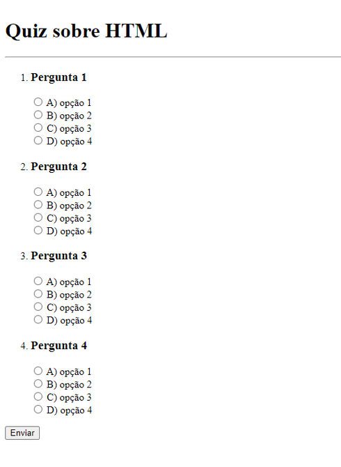

## Projeto

Neste desafio criado como sugestão da Rocketseat, devemos criar um quiz de perguntas e respostas.

**Requisitos para o desafio:**

- Adicionar no mínimo 3 perguntas com 4 opções de respostas cada.

- Usar a lista ordenada para criar as perguntas e inputs do tipo radio para as opções de respostas.

- Lembre-se de dar um título para o documento usando a tag <title>

- Ao finalizar, o resultado será parecido com o da imagem abaixo:

